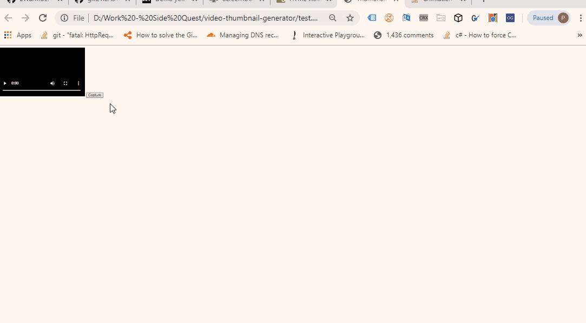

# video-thumbnail-generator
Used to generates thumbnail sprite for a video on the client

call captureVideo() with the html5 video element as first parameter
and a container that will be filled up with images from the video

original source code from 2016

similar projects =^-^= 
https://www.npmjs.com/package/video-thumbnail-generator
https://github.com/flavioribeiro/video-thumbnail-generator